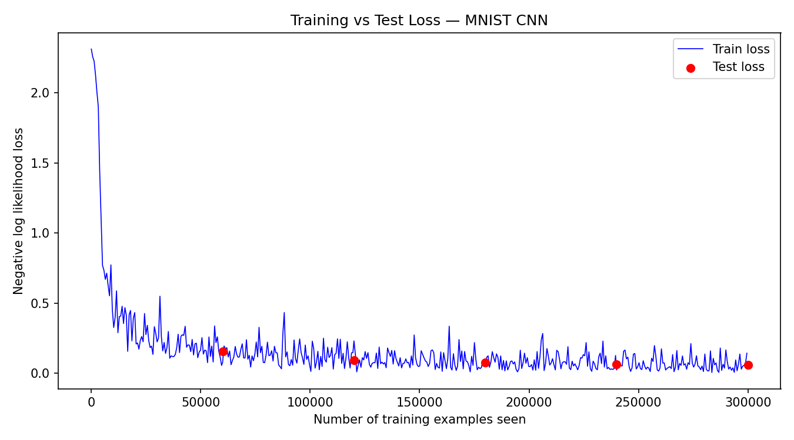
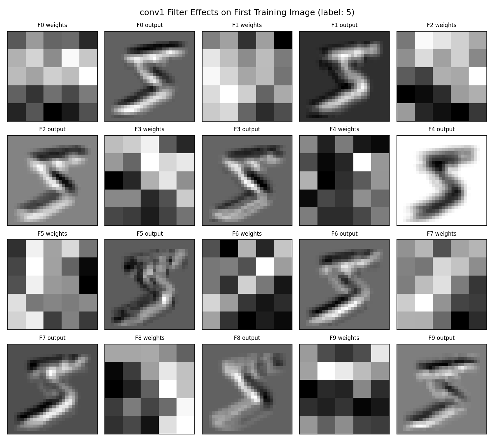
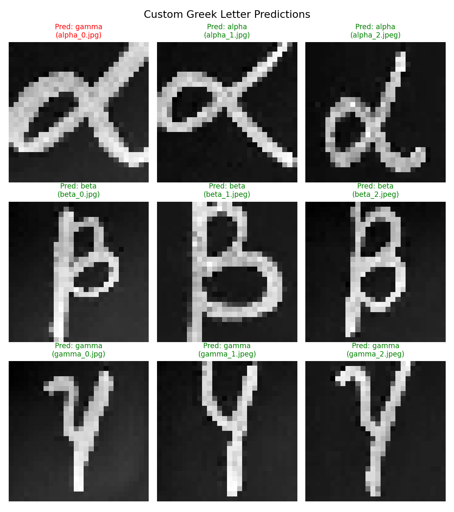
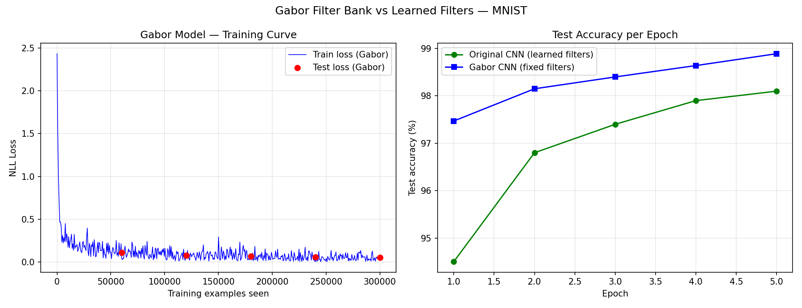

# Project 5: Recognition using Deep Networks
### CS5330 — Pattern Recognition & Computer Vision
**Ahilesh Vadivel | Northeastern University**

---

## Overview

This project explores deep learning for image recognition, starting from building a CNN from scratch to transfer learning, transformer architectures, hyperparameter optimization, and a Gabor filter extension. The primary dataset used is MNIST handwritten digits, with Fashion MNIST used for the hyperparameter experiments.

---

## Tasks

### Task 1 — Build and Train a CNN



### Task 1 — Build and Train a CNN
- Loaded and visualized the MNIST digit dataset
- Built a CNN with two convolutional blocks, max pooling, dropout, and fully connected layers
- Trained for 5 epochs achieving **98.6% test accuracy**
- Tested on custom handwritten digit photos (8/10 correct)
- Saved the trained model to `mnist_model.pth`

### Task 2 — Examine the Network


- Visualized the 10 learned 5×5 filters from `conv1` as heatmaps
- Applied each filter to a training image using `cv2.filter2D` and analyzed the outputs
- Identified edge detectors, contrast enhancers, diagonal filters, texture filters, and smoothing filters

### Task 3 — Transfer Learning on Greek Letters
- Adapted the pre-trained MNIST network to classify 3 Greek letters: **alpha, beta, gamma**
- Froze all layers except the final `fc2` layer (replaced with `Linear(50 → 3)`)
- Trained on only **27 examples**, achieving near-perfect classification within ~15 epochs
- Tested on custom handwritten Greek letter photos (8/9 correct)

### Task 3 — Transfer Learning on Greek Letters



### Task 4 — Vision Transformer (ViT)
- Re-implemented the recognition pipeline using Transformer encoder layers
- Used overlapping patch embeddings, multi-head self-attention, and token averaging
- Achieved comparable accuracy (~97–98%) to the CNN with higher training variance

### Task 5 — Hyperparameter Search on Fashion MNIST
Systematically evaluated **4 dimensions** using a round-robin linear search strategy (~62 configurations):

| Dimension | Range | Best Value |
|---|---|---|
| Conv filter counts | 8/16 → 48/96 | 48/96 (consistent gains) |
| Dropout rate | 0.1 → 0.6 | 0.1 (lower = better for 5 epochs) |
| FC hidden nodes | 32 → 1024 | 512 (plateau after) |
| Batch size | 16 → 512 | 16–32 (clear monotonic drop) |

### Extension — Gabor Filter Bank


- Replaced `conv1` with a **fixed hand-crafted Gabor filter bank** (10 filters, 5 orientations × 2 frequencies)
- Frozen first layer, trained only `conv2`, `fc1`, `fc2`
- **GaborNet achieved 98.9% accuracy — outperforming the fully trained CNN by +0.8%**
- Converged 3% faster at epoch 1 (97.5% vs 94.5%)

---

## Results Summary

| Model | Test Accuracy |
|---|---|
| CNN (Task 1) | 98.6% |
| Transfer Learning — Greek (Task 3) | 8/9 custom images |
| Vision Transformer (Task 4) | ~97–98% |
| Fashion MNIST best config (Task 5) | 89.4% |
| GaborNet Extension | **98.9%** |

---

## Project Structure

```
Project_5/
│
├── task1_mnist.py          # Task 1: Build, train, and evaluate CNN
├── task1e_eval.py          # Task 1E: Run model on first 10 test examples
├── task1f_custom.py        # Task 1F: Test on custom handwritten digits
├── task2_examine.py        # Task 2: Analyze and visualize conv1 filters
├── task3_greek.py          # Task 3: Transfer learning on Greek letters
├── task4_transformer.py    # Task 4: Vision Transformer implementation
├── task5_experiment.py     # Task 5: Hyperparameter search on Fashion MNIST
├── extension_gabor.py      # Extension: Gabor filter bank as fixed first layer
│
├── mnist_model.pth         # Saved MNIST CNN weights
├── greek_model.pth         # Saved Greek transfer model weights
├── transformer_model.pth   # Saved Transformer model weights
│
├── custom_digits/          # Custom handwritten digit images (0–9)
├── custom_greek/           # Custom handwritten Greek letter images
├── greek_train/            # Greek letter training dataset
│   └── greek_train/
│       ├── alpha/
│       ├── beta/
│       └── gamma/
│
└── data/                   # MNIST / Fashion MNIST (auto-downloaded)
```

---

## Setup & Installation

### Prerequisites
- Python 3.11+
- VS Code (recommended)

### 1. Clone the repository
```bash
git clone https://github.com/your-username/Project_5_PRCV.git
cd Project_5_PRCV
```

### 2. Create and activate a virtual environment
```bash
# Windows
python -m venv venv
.\venv\Scripts\Activate.ps1

# Mac/Linux
python -m venv venv
source venv/bin/activate
```

### 3. Install dependencies
```bash
pip install torch torchvision matplotlib opencv-python pillow numpy
```

---

## Running the Code

```bash
# Task 1 — Train the CNN
python task1_mnist.py

# Task 1E — Evaluate on first 10 test images
python task1e_eval.py

# Task 1F — Test on custom handwritten digits
python task1f_custom.py

# Task 2 — Examine network filters
python task2_examine.py

# Task 3 — Transfer learning on Greek letters
python task3_greek.py

# Task 4 — Vision Transformer
python task4_transformer.py

# Task 5 — Hyperparameter search
python task5_experiment.py

# Extension — Gabor filter bank
python extension_gabor.py
```

---

## Dependencies

| Package | Purpose |
|---|---|
| `torch` | Core deep learning framework |
| `torchvision` | Datasets and image transforms |
| `matplotlib` | Plotting training curves and visualizations |
| `opencv-python` | Applying filters manually (Task 2B, Extension) |
| `pillow` | Loading custom images |
| `numpy` | Numerical operations and filter construction |

---

## Acknowledgements

- **PyTorch & Torchvision** — https://pytorch.org
- **MNIST Dataset** — Yann LeCun et al.
- **Fashion MNIST** — Zalando Research — https://github.com/zalandoresearch/fashion-mnist
- **Greek Letter Dataset** — Provided as course material for CS5330
- **PyTorch Tutorial** — https://pytorch.org/tutorials
